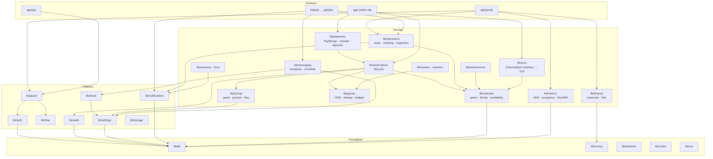

# 1 — System architecture

## The shape of it

One deployable unit. The public website, the staff portal, the booking engine,
the webhooks and the cron endpoint are all the same Next.js application, which
means there is exactly one place a reservation can be written and exactly one
copy of the rule that says it may not overlap another.

```
                    ┌───────────────────────────────────────────┐
   Guest's phone ──▶│                                           │
   Owner's laptop ─▶│         Next.js 15 (App Router)           │
   Cleaner's phone ▶│         React 19 Server Components        │
                    │                                           │
                    │  /            public site + booking       │
                    │  /portal      staff portal (RBAC)         │
                    │  /api/public  availability, quote, book   │
                    │  /api/webhooks/paymongo   payment truth   │
                    │  /api/ical/[token].ics    export feed     │
                    │  /api/jobs/*  cron: minute, daily         │
                    └───────┬───────────────────┬───────────────┘
                            │                   │
                    Prisma  │                   │  fetch()
                            ▼                   ▼
              ┌───────────────────┐   ┌──────────────────────────┐
              │ Supabase Postgres │   │ PayMongo   payments      │
              │  + btree_gist     │   │ Resend     email         │
              │  + PITR backups   │   │ Airbnb     iCal in/out   │
              └───────────────────┘   │ Supabase   Storage       │
                                      └──────────────────────────┘
```

Deployed on Vercel, region `sin1`/`bom1` (nearest to Manila). The database is
Supabase Postgres. Storage is Supabase Storage, reached over its REST API with
a service-role key that never leaves the server.

## Why this stack

| Choice | Reason |
|---|---|
| **Next.js 15 App Router, React 19** | One unit for site + portal + API. Server Components keep the cleaner's phone bundle small; Server Actions put every mutation on the server, where authorization actually lives. |
| **Postgres + Prisma** | The data is relational and the money must reconcile. More importantly Postgres has `EXCLUDE USING gist`, which is the only honest way to make a double booking *impossible* rather than merely unlikely. |
| **Session auth (JWT cookie + bcrypt)** | Seven staff accounts do not justify a per-user auth bill or a third party that can lock the owner out of her own calendar. ~200 lines, no vendor. Supabase is used for Postgres and Storage, not for Auth. |
| **Tailwind CSS 4** | No runtime. Touch targets are enforced once, in `globals.css`, because half the users are on a phone with wet hands. |
| **PayMongo** | GCash, Maya, cards and online banking, no monthly fee, the PH default. Falls back to a simulated checkout when no keys are set, so the whole book → pay → confirm chain is demonstrable out of the box. |
| **Resend** | Transactional email with a free tier. Without a key, mail is logged and recorded instead of sent — development never silently breaks. |
| **Money as integer centavos** | ₱1,234.50 is `123450`. P&L, ADR and RevPAR are exact and reproducible. |

Deliberately **not** dependencies: no state library, no component kit, no chart
library, no date library, no iCal library (RFC 5545 for our subset is ~80 lines
and a dependency here would be a supply-chain risk on a file we hand to Airbnb).

## Module dependency map

Arrows point at what a module is allowed to import. Nothing points backwards —
`lib/finance` may read a reservation, a reservation may never call finance.



### The two rules that keep this map honest

1. **The calendar is the only writer of occupancy.** A reservation does not
   block dates by existing; it blocks dates by holding a `CalendarSpan`.
   Airbnb imports, owner blocks and maintenance blocks hold spans in the same
   table under the same constraint. There is therefore one definition of
   "occupied", and it is enforced by Postgres rather than by whoever wrote the
   last query.

2. **Automations are jobs, not side effects of a page load.** Everything in
   §8 of the brief is either a database transaction that happens inline with
   the thing that caused it (checkout → cleaning task) or a row in
   `ScheduledMessage`/`Notification` that a cron endpoint drains. Nothing
   depends on a human having a browser tab open.

## Request paths worth knowing

**Public booking** — `POST /api/public/booking` runs one transaction:
resolve or create the guest → price the stay server-side (the client's number is
never trusted) → insert the reservation → insert the `CalendarSpan`. If the span
insert trips the exclusion constraint the whole transaction rolls back and the
guest is told the dates just went. Only then is a PayMongo checkout session
created, and the reservation sits `PENDING` with a hold expiry.

**Payment truth** — `POST /api/webhooks/paymongo` verifies the signature, then
promotes the reservation to `CONFIRMED` and schedules the guest's message
sequence. The browser's return from the gateway only *displays* status; it never
sets it.

**Cron** — `POST /api/jobs/minute` (every 15 min: iCal polling, message
dispatch, hold expiry) and `POST /api/jobs/daily` (reminders, document expiry,
low stock, KPI snapshot). Both take a bearer `CRON_SECRET` and are idempotent —
running one twice in a day changes nothing.

## Scale posture

Every operational table carries `propertyId`; every property carries `branchId`.
Nothing is written against "the property" or "the branch". Today there are three
properties in two branches and the branch selector is a two-item dropdown; the
queries behind it are already the multi-branch ones, so the day a fourth
property in Cebu appears, it is a row, not a release.
