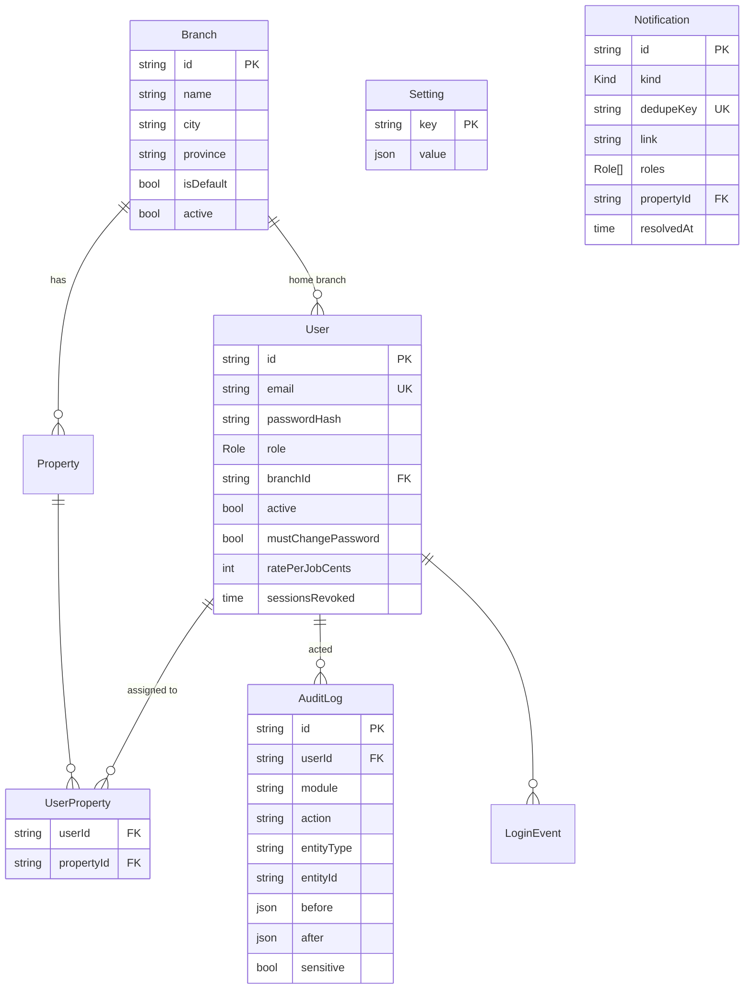
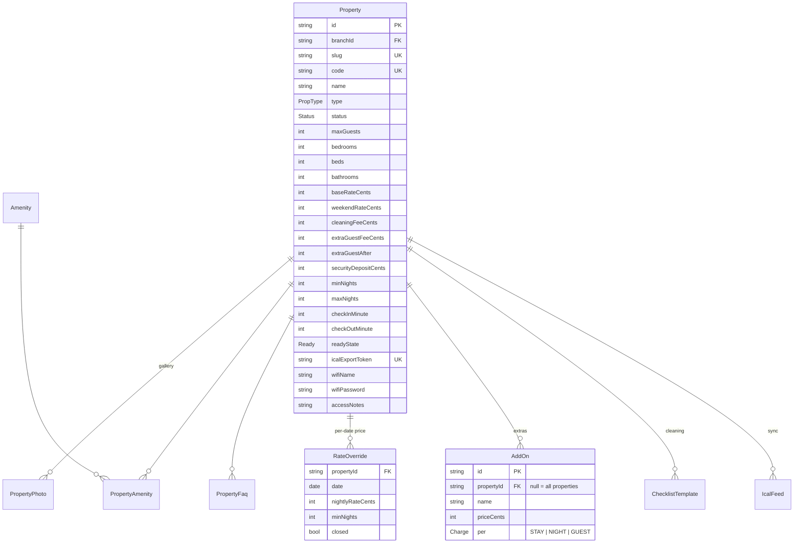
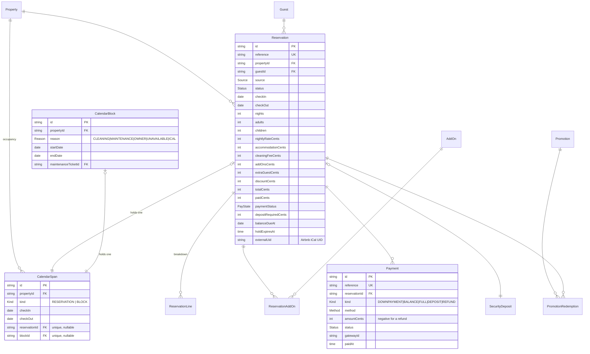
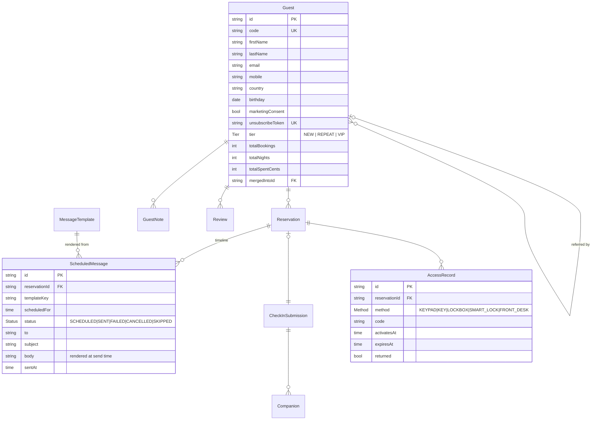
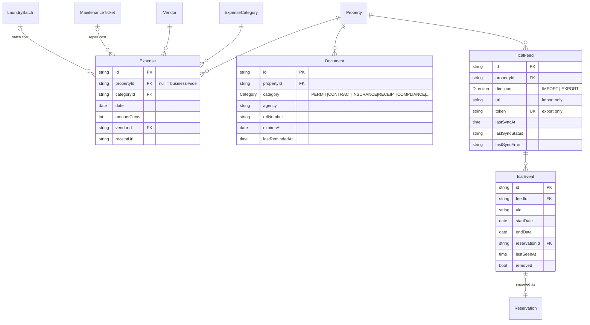

# 4 — Data model

Fifty-odd tables, drawn here in six domains because one diagram of all of them
is a picture of a hairball. The authoritative version is
[`prisma/schema.prisma`](../prisma/schema.prisma); this document exists to
explain the decisions that a schema file cannot.

## The one that matters: double booking is impossible

Every other design choice here is negotiable. This one is not.

**Occupancy lives in exactly one table.** A reservation does not block dates by
existing — it blocks them by owning a row in `CalendarSpan`. Owner blocks,
cleaning blocks, maintenance blocks and Airbnb imports own rows in the same
table. So there is a single definition of "these dates are taken", and Postgres
enforces it:

```sql
CREATE EXTENSION IF NOT EXISTS btree_gist;

ALTER TABLE "CalendarSpan"
  ADD CONSTRAINT "CalendarSpan_no_overlap"
  EXCLUDE USING gist (
    "propertyId" WITH =,
    daterange("checkIn", "checkOut", '[)') WITH &&
  );
```

Three things follow from `'[)'` — start inclusive, end exclusive:

- A stay of 1–5 Aug and a stay of 5–9 Aug do **not** overlap. Same-day turnover
  is normal in this business and the constraint must not forbid it.
- A one-night stay is `[1 Aug, 2 Aug)`. Zero-night ranges are rejected by a
  `CHECK ("checkOut" > "checkIn")` alongside.
- Nights = `checkOut - checkIn`, always, with no timezone in the arithmetic.

The application does not check for conflicts before writing. It writes, and
catches SQLSTATE `23P01`:

```ts
try   { await tx.calendarSpan.create({ ... }) }
catch (e) { if (isOverlapError(e)) throw new HttpError(409, 'Those dates were just taken.') }
```

That ordering is the whole point. A check-then-write races: two guests both
read "available" a millisecond apart and both write. A write-and-catch cannot,
because the second `INSERT` blocks on the first one's index entry and then
fails. `tests/booking-race.test.ts` fires N concurrent bookings at the same
dates and asserts exactly one survives.

Spans are **deleted**, not flagged, when a reservation is cancelled or a hold
expires. A partial-index predicate would have worked too, but deletion means the
constraint has no exceptions to reason about, and a cancelled reservation still
keeps its own dates on its own row for the record.

## Domain 1 — Organisation and access



`Role` is `OWNER | MANAGER | RESERVATIONS | ACCOUNTANT | CLEANER | INSPECTOR |
MAINTENANCE`. `AuditLog` is append-only: nothing in the application updates or
deletes a row, and `before`/`after` hold the shallow diff so a reservation edit
shows what actually changed.

## Domain 2 — Property and its public content



Everything a guest reads on a property page is a column or a related row here.
Nothing about a property is a string literal in a `.tsx` file, which is what
makes "Admin edits photos, rates, promos, FAQs and site text with no code
changes" true rather than aspirational. Site-wide copy lives in `Setting`;
site-wide FAQs are `PropertyFaq` rows with a null `propertyId`.

`readyState` is a cached answer (`READY | CLEANING | INSPECTION | BLOCKED`)
derived from open cleaning and inspection tasks. It is a convenience for the
dashboard, never the source of truth — the gate in §6.2 is enforced by asking
the tasks, not by trusting this column.

## Domain 3 — Calendar, reservations and money in



Notes on the money columns:

- **`totalCents` is stored, not derived at read time.** It is the number the
  guest agreed to; a later change to a property's cleaning fee must not
  retroactively rewrite a booking made last month. `ReservationLine` holds the
  itemisation that adds up to it, so the breakdown on a confirmation email a
  year later still reconciles.
- **`paidCents` is a cache of `sum(Payment.amountCents where status = PAID)`**,
  refreshed inside the same transaction that writes a payment. `balance` is
  `totalCents - paidCents` and is never stored, because two stored numbers that
  must agree eventually disagree.
- **Refunds are negative payments**, not a separate table. One timeline per
  reservation, and `paidCents` needs no special case.
- **Airbnb reservations carry `externalUid`** and typically no money at all —
  the platform collects. Their revenue is entered as a payout, so occupancy is
  right even when the cash arrives elsewhere and late.

## Domain 4 — Guest, communication and check-in



`ScheduledMessage` is both the queue and the log — one row per intended
message, moving `SCHEDULED → SENT`. A manual send writes a row with
`scheduledFor = now`, so the reservation's communication timeline is one query
in one table and nothing sent is invisible.

Merging duplicate guests sets `mergedIntoId` on the loser and repoints its
reservations. The row is kept, so a reference to it from an old audit entry
still resolves.

`AccessRecord` is record-keeping in v1: what code was issued, when it activates
and when it lapses. No lock is contacted. The table is shaped so that a
smart-lock adapter later fills in a `deviceId` and an `externalId` without a
migration to the columns anyone already reads.

## Domain 5 — Operations

```mermaid
erDiagram
    Task              |o--|| CleaningTask       : "detail"
    Task              |o--|| Inspection         : "detail"
    Task              |o--|| MaintenanceTicket  : "detail"
    Property          ||--o{ Task               : ""
    User              ||--o{ Task               : "assignee"
    Reservation       |o--o{ CleaningTask       : "turnover of"
    ChecklistTemplate ||--o{ ChecklistItem      : ""
    CleaningTask      ||--o{ ChecklistResult    : ""
    ChecklistItem     ||--o{ ChecklistResult    : ""
    CleaningTask      ||--o{ CleaningRestock    : ""
    InventoryItem     ||--o{ CleaningRestock    : ""
    Inspection        ||--o{ InspectionArea     : ""
    Property          ||--o{ Incident           : ""
    Property          ||--o{ InventoryItem      : ""
    InventoryItem     ||--o{ InventoryMovement  : "ledger"
    Property          ||--o{ LinenItem          : ""
    LinenItem         ||--o{ LaundryBatchLine   : ""
    LaundryBatch      ||--o{ LaundryBatchLine   : ""
    Vendor            ||--o{ LaundryBatch       : ""

    Task {
        string   id PK
        string   propertyId FK
        Kind     kind "CLEANING|INSPECTION|MAINTENANCE|RESTOCK|ARRIVAL_PREP|FOLLOW_UP|MANUAL"
        string   title
        string   assigneeId FK
        time     dueAt
        Priority priority
        Board    status "OPEN|IN_PROGRESS|BLOCKED|DONE|CANCELLED"
        string   reservationId FK
    }
    CleaningTask {
        string id PK
        string taskId FK UK
        string reservationId FK
        time   checkoutAt
        time   nextCheckInAt "the deadline"
        Status status "PENDING|ASSIGNED|IN_PROGRESS|INSPECTION|COMPLETED"
    }
    ChecklistItem {
        string id PK
        string templateId FK
        string area
        string label
        bool   requiresPhoto
        bool   mandatory
    }
    ChecklistResult {
        string cleaningTaskId FK
        string itemId FK
        bool   done
        string photoUrl
    }
    Inspection {
        string id PK
        string taskId FK UK
        string cleaningTaskId FK
        Status status "PENDING|IN_PROGRESS|PASSED|NEEDS_ATTENTION|FAILED"
    }
    InventoryMovement {
        string id PK
        string itemId FK
        Kind   kind "PURCHASE|USAGE|ADJUSTMENT"
        int    quantity "signed"
        string cleaningTaskId FK
    }
```

**Why `Task` is a spine and not four separate boards.** The brief asks for one
board that a cleaner opens on her phone and one that a manager filters by
property and day. Assignment, deadline, priority and board status are the same
four questions for a cleaning, an inspection, a restock and a repair, so they
live once, in `Task`. What differs — a checklist, a verdict, a parts-waiting
state — lives in the detail table with a unique `taskId`.

The cost is that two rows describe one job, and their statuses could drift. One
function, `syncTask()`, owns that mapping; nothing else writes `Task.status`
for a task that has a detail row. That is the only invariant here worth being
nervous about, and it is a single 20-line function under test.

**Inventory is a ledger, not a counter.** `InventoryItem.stockQty` is a cached
sum of its movements. Finishing a cleaning checklist with "restocked 2 rolls"
writes a `USAGE` movement of `-2` linked to the cleaning task, so the question
"where did the coffee go" has an answer with a date and a name on it.

**Linen carries six counters** (clean / in use / dirty / at laundry / damaged /
missing) on `LinenItem`, each change written as a `LinenMovement`. Sets go out
on a `LaundryBatch`, come back short or damaged, and the batch cost becomes an
expense.

## Domain 6 — Money out, documents, sync



An expense with a null `propertyId` is business-wide (marketing, the owner's
accounting fee) and is apportioned in the consolidated P&L but appears on no
single property's statement. That is a reporting decision made once, here, so
the per-property and consolidated numbers cannot silently disagree.

`IcalEvent.lastSeenAt` is how reconciliation works: a poll stamps every event it
sees, and anything not stamped this round is a cancellation on the other side —
its span is released.

## Conventions applied everywhere

| Convention | Why |
|---|---|
| `propertyId` on every operational table | Multi-property from the first row, not from a later migration. |
| `branchId` on `Property` and `User` | A city-level view and a consolidated view are the same query with a different `where`. |
| Money = `Int` centavos | Exact arithmetic. ADR, RevPAR and P&L reconcile to the peso. |
| Stay dates = `@db.Date` | A check-in is a calendar date, not an instant. No timezone can shift it. |
| Timestamps = `DateTime` UTC | Displayed via Manila helpers; stored without ambiguity. |
| No hard deletes on money, reservations, incidents or audit | Cancellations and voids are status changes with a reason and an author. |
| `code` / `reference` on guest-facing rows | Humans read them aloud over the phone; the alphabet excludes `I O 0 1`. |

## What is modelled but not built (§12)

`AccessRecord.method` already has `SMART_LOCK`; `IcalFeed` sits behind a
`ChannelSync` interface so a channel manager is a second implementation;
`MessageTemplate.channel` has `SMS` and `WHATSAPP` values with no dispatcher
behind them; `Property.ownerId` and an `OwnerStatement` view are absent but need
only a nullable column on `Property` and a report — no restructuring. None of
these are built. All of them are unblocked.
