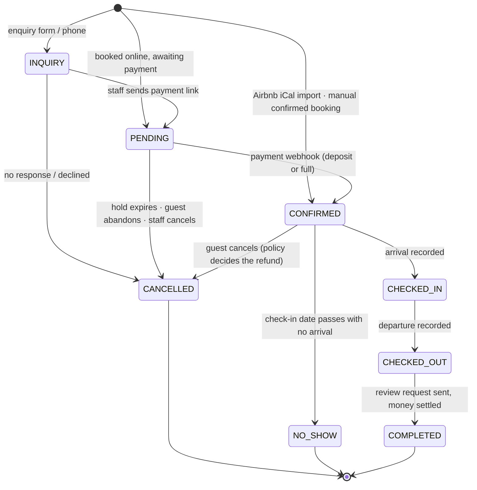
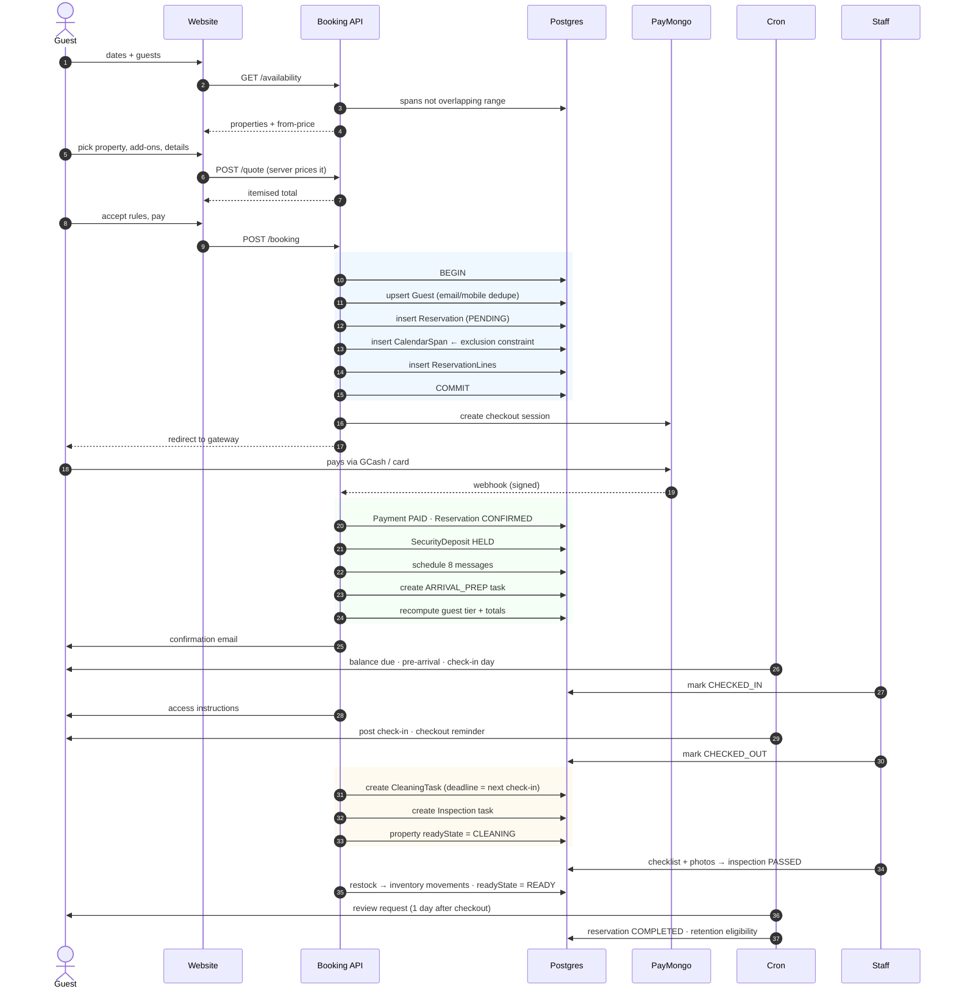
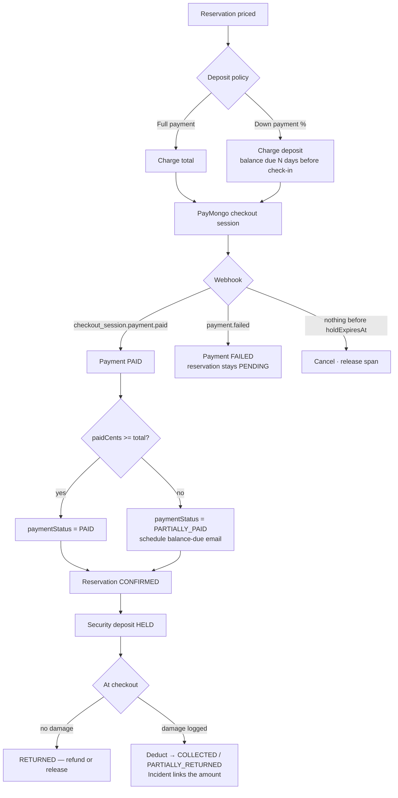
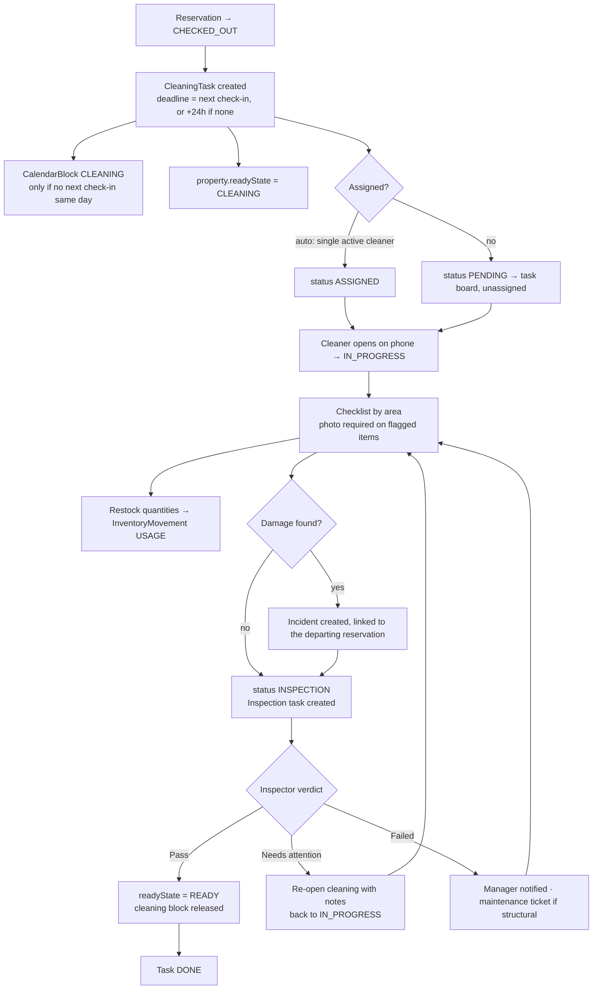
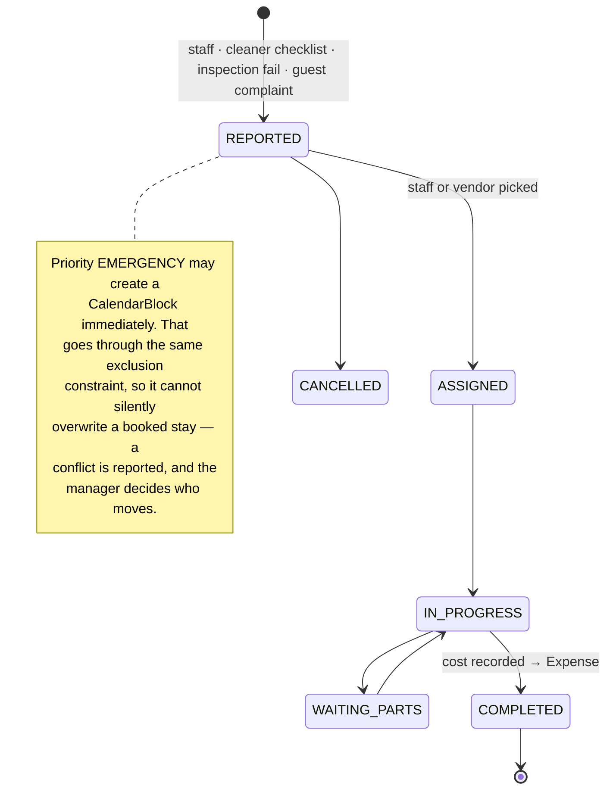
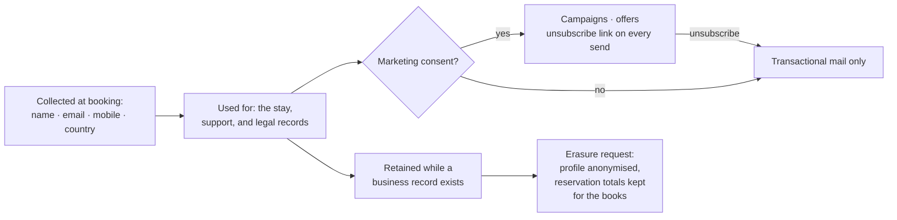

# 5 — Workflows

## 5.1 Reservation lifecycle

**Which states hold the calendar.** `PENDING`, `CONFIRMED`, `CHECKED_IN` and
`CHECKED_OUT` own a `CalendarSpan`. `INQUIRY` does not — an enquiry is not a
hold, and treating it as one is how a calendar fills up with dates nobody paid
for. `CANCELLED` and `NO_SHOW` release their span in the same transaction as
the status change, which is the moment the dates go back on sale.

**The hold clock.** A `PENDING` reservation carries `holdExpiresAt`, default 30
minutes (Settings). `POST /api/jobs/minute` cancels anything past it and deletes
the span. A guest who abandons the gateway therefore ties up the dates for half
an hour and no longer. The webhook is idempotent against this: a payment
arriving for an already-expired reservation re-checks availability, and either
revives it or refunds and tells the guest.

**Editing dates on a live reservation** is delete-span-then-insert-span inside
one transaction. If the new dates collide the transaction rolls back and the
reservation keeps the dates it had. There is no window in which it holds
neither.

## 5.2 Guest journey — the §8 chain, end to end

Every arrow from `API` or `J` to `DB` is code, not a person. The only human
steps in the chain are the two check marks (arrived, departed), the cleaning
itself, and the inspection verdict — which is exactly the set of things a
person has to physically observe.

## 5.3 Payment

Rules that are not obvious:

- **The client's price is never trusted.** `POST /booking` re-prices the stay
  server-side from the property, the date range, the add-ons and the promo code,
  and if the result differs from what the browser showed, the server's number
  wins and the guest sees it before paying.
- **Only the webhook confirms.** The browser returning from PayMongo renders a
  "we're confirming your payment" state that polls; it never writes status.
  Signature verification uses the HMAC in the `paymongo-signature` header and
  rejects anything older than five minutes.
- **Refunds are issued through PayMongo where a gateway payment exists**, and
  recorded as a negative `Payment` either way — a bank transfer refunded by hand
  still shows on the reservation's timeline.
- **PayMongo will not take less than ₱20 or refund less than ₱1.** Both floors
  are handled in `lib/payments`, not left to fail at the gateway.

## 5.4 Cleaning and turnover

**The READY gate.** A property is bookable-as-ready only when it has no open
cleaning task and no inspection that is not `PASSED`. That predicate lives in
`isReady(propertyId)` and is what the dashboard's "unit not ready" flag and the
arrivals list both call. `readyState` on the property row is a cache of it,
refreshed by `syncReadyState()` at every transition; if the two ever disagree,
the predicate is right.

**Deadline and priority.** `nextCheckInAt` is the next confirmed arrival for
that property. The task's priority is derived: under 4 hours to the deadline is
`URGENT`, same day is `HIGH`, otherwise `MEDIUM`. A cleaner's board is sorted by
it, so the phone always shows the unit that matters most at the top.

## 5.5 Maintenance

An emergency block on dates that are already sold **fails loudly**. The system
will not quietly evict a paying guest; it tells the manager which reservation is
in the way and lets a person make that call.

## 5.6 Guest data lifecycle (PH Data Privacy Act)

Companions are recorded as names and a count, because a guest register is a
practical requirement. No ID numbers, no ID photographs, no passport scans, no
card data — none of it is needed to run the business, and all of it is a
liability to hold.
